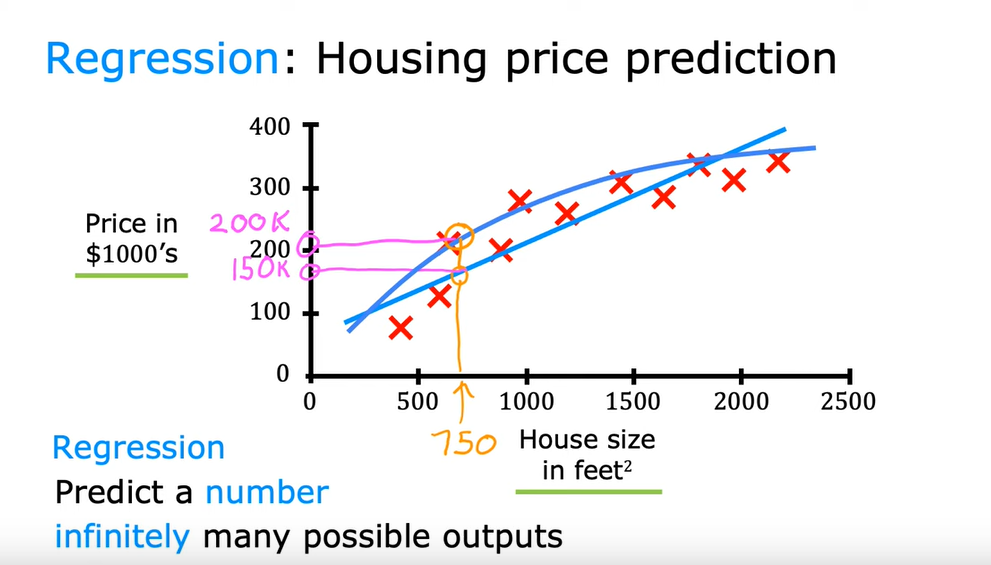
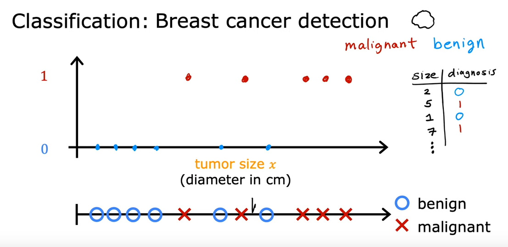
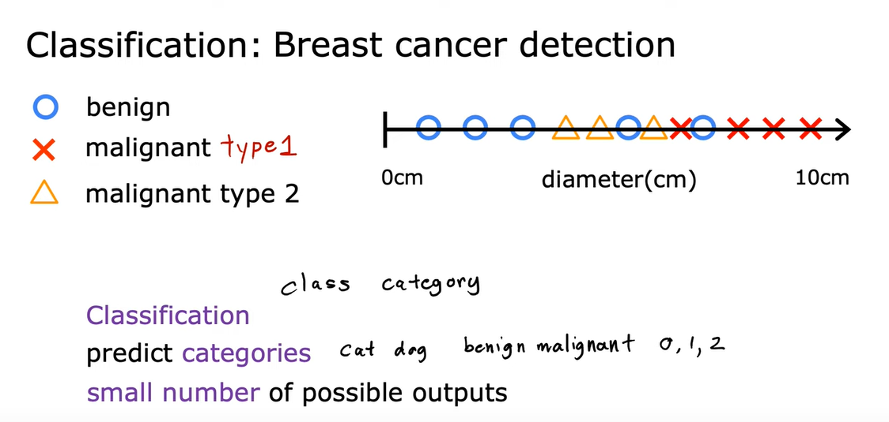
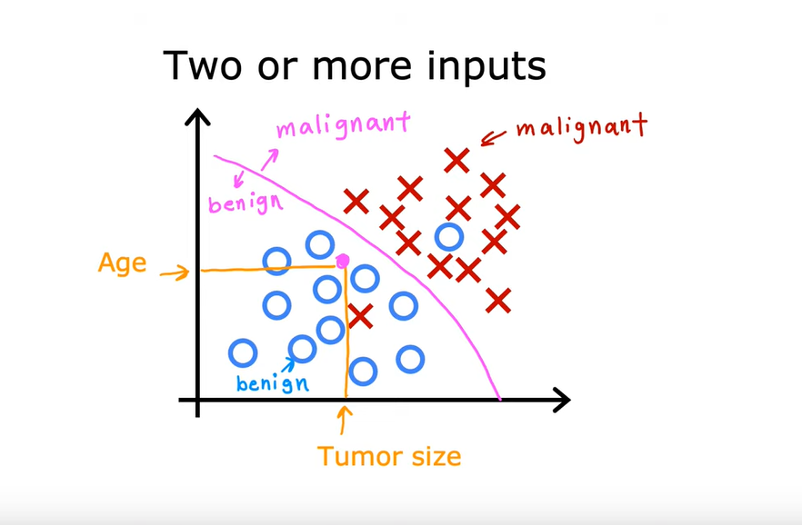
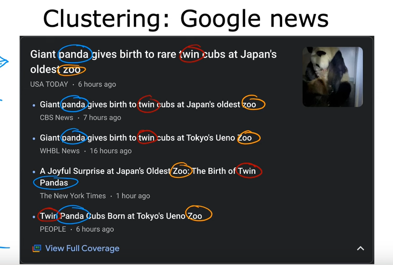
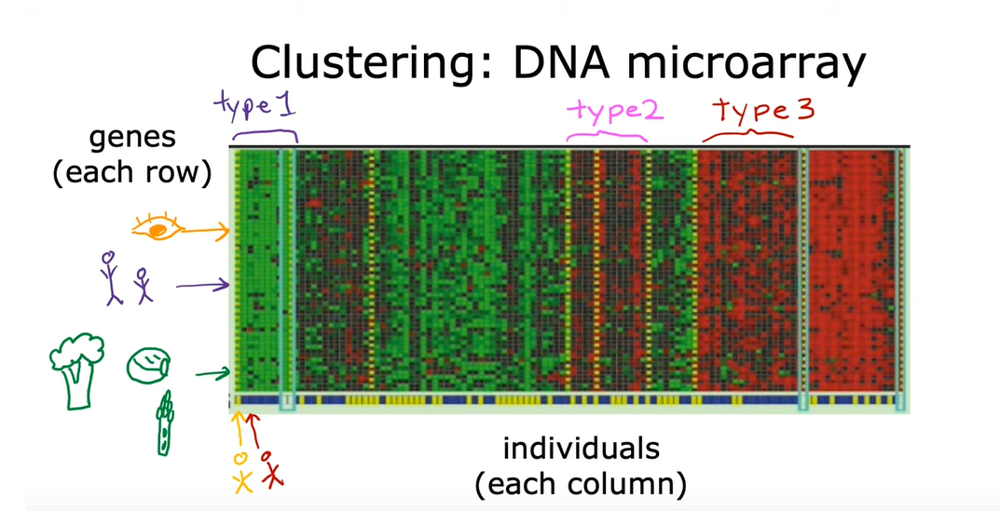
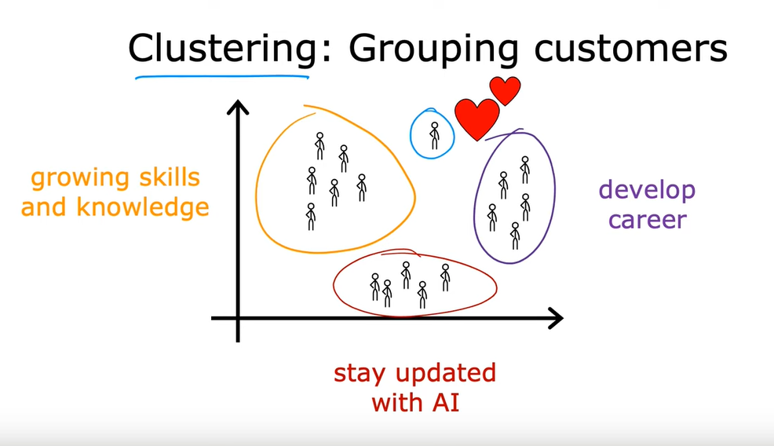

# 📘 Lecture 3 – Defining Machine Learning & Specialization Focus

---

## 📝 Formal Definition of ML
- **Arthur Samuel (1950s)** defined ML as:  
  > "The field of study that gives computers the ability to learn without being explicitly programmed."

---

## 🎮 Historical Example: Samuel’s Checkers Program
- Samuel built a **checkers-playing program**.  
- He wasn’t a strong player himself, but the program:  
  - Played **tens of thousands of games against itself**.  
  - Learned which **board positions led to wins** vs. losses.  
  - Improved over time → eventually **outperformed Samuel**.  

💡 **Key Principle**:  
The more practice (data/examples) a learning algorithm has, the **better it performs**.  
- Example: If the program had only played 100 games, it would be weak.  
- But with 10,000+ games, it became strong.  

---

## 🔑 Two Main Types of ML Algorithms
1. **Supervised Learning**  
   - Learns from **labeled data** (input + correct answer).  
   - Example: Predicting house prices from features like size, location, etc.  

2. **Unsupervised Learning**  
   - Learns from **unlabeled data** (only input, no correct answer).  
   - Example: Grouping customers into segments based on buying habits.  

---

## 📚 Course Structure
- **Course 1 & 2** → Focus on **Supervised Learning**.  
- **Course 3** → Covers **Unsupervised Learning, Recommender Systems, and Reinforcement Learning**.  
- Most widely used ML methods today:  
  - Supervised Learning  
  - Unsupervised Learning  
  - Recommender Systems  

---

## 🛠️ Practical Application & Best Practices
- Learning algorithms = **having tools**.  
- Success depends on **knowing how to use them effectively**.  
- Even experienced teams can spend **months going the wrong way** if they lack best practices.  
- This course will teach **how top ML engineers build real systems**, making learners capable of building **serious ML projects**.  

---

## ⏭️ What’s Next?
- Next Lectures will explain:  
  - **Supervised learning** in detail.  
  - **Unsupervised learning** in detail.  
  - When to use each method.  

---

## ✅ Key Takeaways
- ML enables computers to learn without explicit programming.  
- Arthur Samuel’s checkers program showed the **power of self-learning**.  
- Two main ML types: **Supervised** and **Unsupervised**.  
- The course focuses on both algorithms **and** real-world best practices.  

---

---
# 📘 Lecture 4 – Supervised Learning (Part 1)

---

## 🌟 Importance of Supervised Learning
- About **99% of today’s ML economic value** comes from **Supervised Learning**.  
- It works by learning **Input (X) → Output (Y)** mappings.  
- The algorithm is trained with examples that include the **right answers (labels)**.  
- Once trained, it can make predictions for **new, unseen inputs**.  

---

## 🔄 Real-World Applications of Supervised Learning

| **Input (X)**       | **Output (Y)**           | **Application**        |
|----------------------|--------------------------|-------------------------|
| Email               | Spam? (0/1)             | Spam Filtering          |
| Audio               | Text Transcript         | Speech Recognition      |
| English Text        | Spanish Text            | Machine Translation     |
| Ad + User Info      | Click? (0/1)            | Online Advertising      |
| Image + Radar Info  | Position of Cars        | Self-Driving Cars       |
| Product Image       | Defect? (0/1)           | Manufacturing Inspection|

📌 **Example:**  
- If the input is an **email**, the algorithm learns to predict whether it’s **spam or not spam**.  
- If the input is an **image of a phone**, the algorithm outputs whether it has a **scratch or defect**.  

---

## 🏠 Example: Housing Price Prediction
- **Goal:** Predict house price from **house size (sq. feet)**.  
- Training data: house sizes with known prices.  

### Predictions:
1. **Straight Line Fit** → Predicts ~$150K for a 750 sq. ft. house.  
2. **Curve Fit** → Predicts ~$200K for the same house.  

📌 Later in the course → you’ll learn how to choose the **best fit (line vs. curve)** systematically.  

---

## 📊 Regression
- **Definition:** Predicting a **number** (continuous value).  
- Example: House price prediction.  
- Output can be **any number** (e.g., $70K, $150K, $183K).  
- Unlike classification, where outputs are **categories**.  

---

## ✅ Key Takeaways
- Supervised learning = learning from labeled examples.  
- Real-world impact across spam filters, speech, ads, self-driving cars, and factories.  
- Housing price prediction illustrates **regression**.  
- Next: **Classification**, another major supervised learning approach.  

---

---
# 📘 Lecture 5 – Supervised Learning (Part 2: Classification)

---

## 🌟 What is Classification?
- **Regression** → predicts a **number** (infinite possibilities).  
- **Classification** → predicts a **category** from a **small, finite set of outputs**.  
- The algorithm learns from labeled examples (X → Y) and then assigns **new inputs** to one of the known categories.  

---

## 🏥 Example: Breast Cancer Detection
- **Goal:** Help doctors detect breast cancer early.  
- **Input (X):** Patient’s medical records.  
- **Output (Y):**  
  - `0` → Tumor is **benign** (not cancerous).  
  - `1` → Tumor is **malignant** (cancerous).  

📌 The system learns from past cases. When a new patient comes in, it predicts if their tumor is **benign** or **malignant**.  

 

---

## 🔢 Categories vs. Numbers
- **Regression** → Output is a **number** (e.g., house price = $183,000).  
- **Classification** → Output is a **category** (e.g., benign vs malignant).  
- Categories don’t have to be numbers (e.g., **cat** vs **dog**).  
- If they are numbers (0, 1, 2), the meaning is **labels**, not values (e.g., no "0.5 cancer").  

---

## 📊 Comparison: Regression vs Classification

| **Aspect**            | **Regression**                         | **Classification**                      |
|------------------------|----------------------------------------|-----------------------------------------|
| **Output**             | A continuous number                   | A discrete category/class               |
| **Examples**           | Predicting house prices, temperature   | Spam vs Not Spam, Cat vs Dog, Disease   |
| **Possibilities**      | Infinitely many outputs               | Finite set of outputs                   |
| **Numeric Meaning**    | Numbers have real value               | Numbers are just category labels        |

---

## 🎯 Multiple Output Categories
- Not all classification is binary.  
- Example: Tumor could be:  
  - `0` = Benign  
  - `1` = Malignant Type 1  
  - `2` = Malignant Type 2  
- The algorithm then chooses among **3 categories**.  

---

## ➕ Classification with Multiple Inputs
- Real problems often use **more than one input feature**.  
- Example (Breast Cancer Detection):  
  - Input 1: Tumor size  
  - Input 2: Patient age  
  - Output: Benign (O) or Malignant (X)  

📌 The algorithm finds a **decision boundary** that separates categories.  

 

- In real-world medical ML:  
  - Many features are used (e.g., clump thickness, cell size uniformity, cell shape uniformity).  

---

## ✅ Key Takeaways
- **Classification** → Predicts a **category**.  
- Different from **Regression**, which predicts a **number**.  
- Can be **binary** (0/1) or **multi-class** (3+ categories).  
- Often uses multiple inputs (features) to make better predictions.  
- Next topic: **Unsupervised Learning**.  

---

---
# 📘 Lecture 6 – Unsupervised Learning   Part 01 (Finding Structure)

---

## 🌟 What is Unsupervised Learning?
- After **Supervised Learning**, the **second most widely used** type of ML is **Unsupervised Learning**.  
- Unlike supervised methods, there are **no given labels (Y)**.  
- Goal: Let the algorithm **find patterns, structures, or groups** in the data on its own.  
- Instructor says unsupervised learning is **“just as super as supervised learning.”**

---

## 🔑 Difference: Supervised vs. Unsupervised Learning

| Feature | Supervised Learning | Unsupervised Learning |
|---------|---------------------|------------------------|
| **Data** | Input **X** + known label **Y** (e.g., tumor = benign/malignant) | Input **X only** (no labels) |
| **Goal** | Predict correct output label | Find hidden patterns or groups |
| **Example** | Diagnose disease (X = medical records, Y = benign/malignant) | Group patients into categories without labels |

---

## 🌀 How Unsupervised Learning Works
- Called **“unsupervised”** because there’s **no teacher giving the right answers**.  
- The algorithm **figures out structure itself**.  
- Main type introduced: **Clustering** → grouping similar data points together.

---

## 📊 Example 1: Google News (Clustering Articles)
- Every day, thousands of articles are published.  
- **Clustering groups related articles** (e.g., multiple reports about Panda twins at the zoo).  
- It does this by detecting **similar words** like “Panda,” “Zoo,” “Twins.”  
- No human needs to manually label articles — the system figures it out.  
 
---

## 🧬 Example 2: DNA Microarray Data (Clustering People)
- Rows = **genes** (eye color, height, food preferences).  
- Columns = **individuals**.  
- Clustering groups people into **types** (e.g., Type 1, Type 2, Type 3).  
- Scientists don’t pre-define types — the algorithm finds them.  

  

---

## 🛒 Example 3: Market Segmentation (Clustering Customers)
- Businesses often want to **group customers automatically**.  
- Example: DeepLearning.ai community study found clusters of learners:  
  1. People who want to **grow skills & knowledge**.  
  2. People aiming to **develop their career**.  
  3. People wanting to **stay updated with AI**.  
- Each group can then be served differently (targeted ads, events, or resources).  

  

---

## ✅ Key Takeaways
- **Unsupervised Learning** = finding structure without labels.  
- **Clustering** is the most common method.  
- Applications include:  
  - News grouping (Google News)  
  - DNA / gene analysis  
  - Market segmentation / customer grouping  
- Next: Explore **other types of unsupervised learning** beyond clustering.  

---

---
# 📘 Lecture 7 – Formalizing Unsupervised Learning & Other Types

---

## 🌟 What is Unsupervised Learning (Formal Definition)?
- **Supervised Learning** → Data = **inputs (X) + labels (Y)**  
- **Unsupervised Learning** → Data = **only inputs (X)**, no labels  
- **Goal** → Algorithm must **discover patterns, structure, or interesting features** in the data by itself.  

---

## 🔎 Beyond Clustering: Other Types of Unsupervised Learning

1. **Anomaly Detection**
   - Detects **unusual or rare events**.  
   - 🏦 Example: **Fraud detection** in banking (spotting odd transactions).  
   - 🚗 Other uses: detecting unusual sensor readings in self-driving cars.

2. **Dimensionality Reduction**
   - Compresses a **large dataset into a smaller one** while keeping most useful information.  
   - Helps visualize high-dimensional data and reduces computation needs.  
   - ✨ Think of it as "summarizing" data almost magically.

---

## 🧩 Examples: Supervised vs. Unsupervised

| Problem Example       | Type of Learning         | Why? |
|-----------------------|--------------------------|------|
| **Spam Filtering**    | ✅ Supervised            | Uses **labeled emails** (spam / not spam). |
| **Grouping News**     | 🔄 Unsupervised          | Articles clustered by keywords (Panda, Zoo, Twins). |
| **Market Segmentation** | 🔄 Unsupervised        | Customers grouped by purchasing/behavior patterns without labels. |
| **Diagnosing Diabetes** | ✅ Supervised          | Input = medical records, Output = diabetes / no diabetes. |

---

## ✅ Key Takeaways
- **Unsupervised Learning** = no labels, system finds structure.  
- Main methods:  
  1. **Clustering** – grouping data points.  
  2. **Anomaly Detection** – spotting unusual events.  
  3. **Dimensionality Reduction** – compressing data into fewer dimensions.  
- Many real-world applications: fraud detection, market segmentation, scientific data analysis.  

---

## 🚀 What’s Next?
- Coming up: Using **Jupyter Notebooks** to apply ML concepts in practice.  

---

---
# 📘 Lecture 8 – Introduction to Jupyter Notebooks & Optional Labs

---

## 🌟 What is Jupyter Notebook?
- The **most widely used tool** in machine learning & data science today.  
- Used by professionals at **large companies** for coding experiments.  
- In this course → you will use Jupyter **in your web browser**.  
- Important: This is **not simplified** → it’s the **same tool real ML engineers use**.  

---

## 🧑‍💻 Types of Labs in the Course

### 1. Optional Labs (Now)
- Very easy and **completely optional**.  
- You **don’t need to write code** → just run it line by line.  
- No grades, no assessment.  
- Goal: Help you get a **feel for ML code** by reading and running it.  

### 2. Practice Labs (Next Week)
- You will start writing **some code yourself**.  
- More hands-on compared to optional labs.  

---

## 📓 Anatomy of a Jupyter Notebook
A Jupyter Notebook is made of **cells**:  

- **Markdown Cells**  
  - Contain text (explanations, notes).  
  - Edit the text, then press `Shift + Enter` to render formatted text.  

- **Code Cells**  
  - Contain Python code.  
  - Press `Shift + Enter` to run the code in that cell.  

---

## 🏃 How to Use the Optional Lab
1. Scroll through the notebook and explore menus/options.  
2. Select a **cell**, press `Shift + Enter`.  
3. **Read the code** → try to predict what it does.  
4. Run the code → see the result.  
5. **Edit the code** (if you like) and re-run it.  

🎯 Goal: Get comfortable with **Python inside Jupyter Notebook** while having fun.  

---

## ✅ Key Takeaways
- Jupyter = industry-standard tool for ML experiments.  
- Optional labs = easy + no grading → just practice and explore.  
- Labs are a chance to learn Python and ML in a **hands-on way**.  

---

## 🚀 What’s Next?
- In the next lecture, we’ll begin fleshing out the **first supervised learning algorithm**.  

---

---
