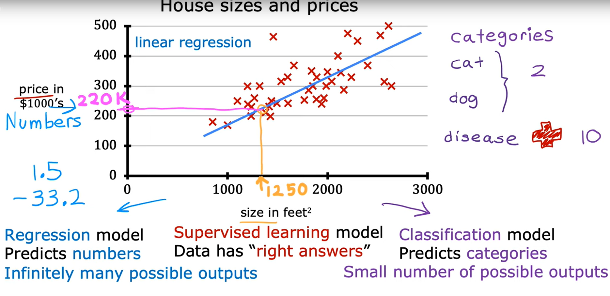
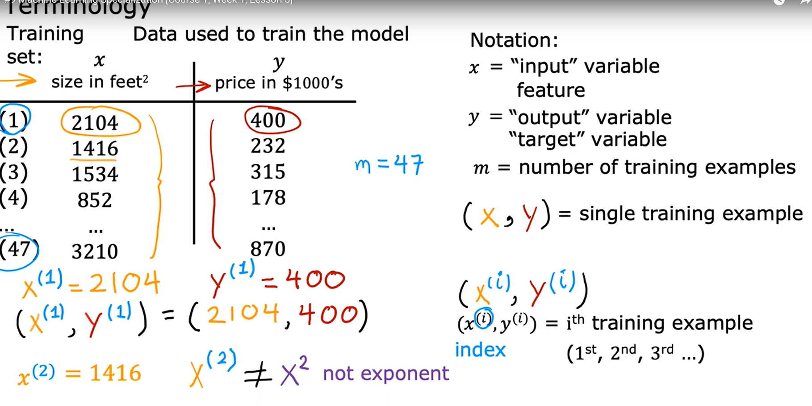
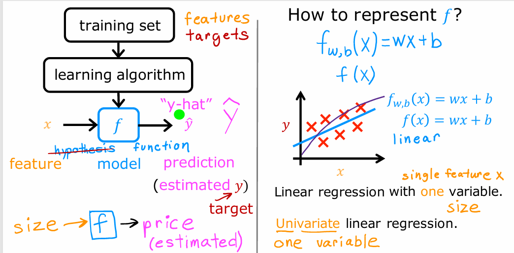
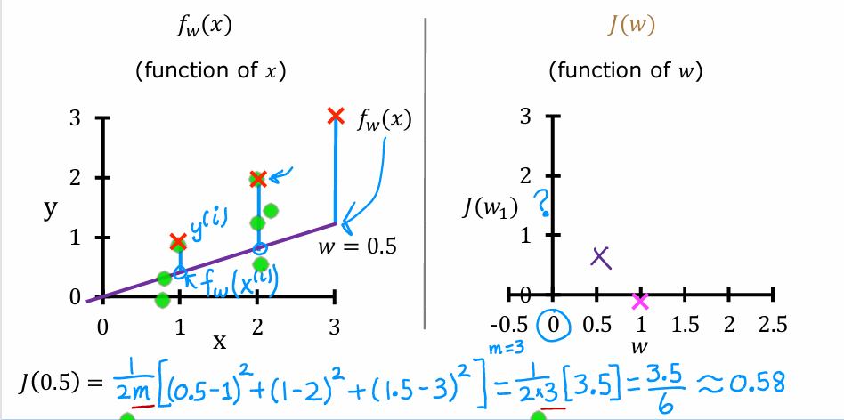
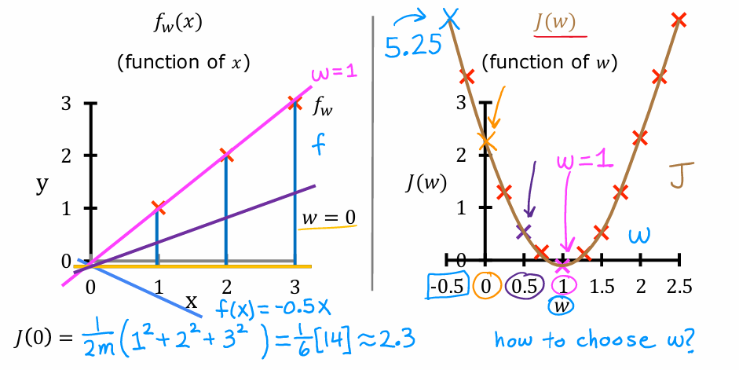
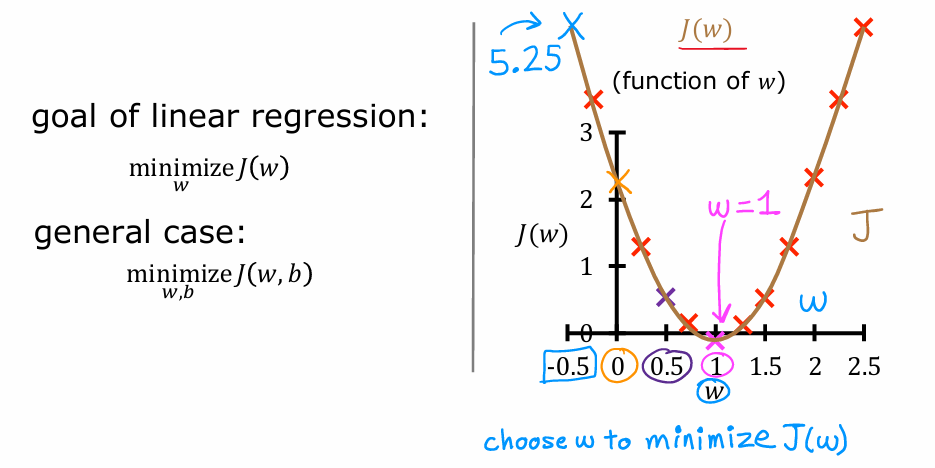
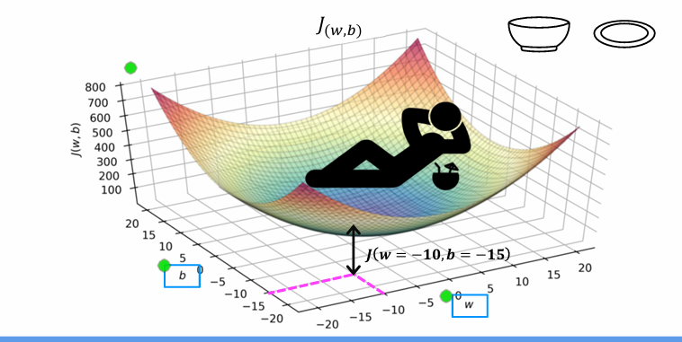
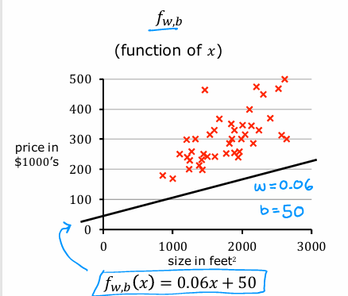

# 📘 Lecture 09: Linear Regression With one variable (Linear R. Model part 1)

## I. Introduction to Linear Regression
- **Linear Regression Model**: Fits a **straight line** to the data.  
- **Why Important?**  
  - One of the **most widely used ML algorithms** today.  
  - Builds foundation: concepts here apply to many other ML models.  

👉 **Key Idea**: Predict outcomes by drawing a line that best fits the training data.

---

## II. Example: Predicting House Prices 🏠

- **Dataset**: House sizes (sq. ft.) vs. house prices ($ in thousands).  
- **Problem**: Estimate price of a **1250 sq. ft. house**.  
- **Solution**: Use linear regression to draw the best-fit line.  
- **Prediction**: The line gives an approximate price of **$220,000**.  

---

## III. Regression vs. Classification (Supervised Learning Context)

| Aspect | Regression | Classification |
|--------|------------|----------------|
| **Output Type** | Numbers (continuous, infinite possibilities). Example: predicting house price = $220,000. | Categories (finite, discrete). Example: cat 🐱 or dog 🐶, or 1 of 10 diseases. |
| **Model Predicts** | Real values (e.g., $1.5, -33.2, 220K). | Classes (e.g., {0, 1}, or {disease A, disease B, disease C}). |
| **Example** | Predict house price from size. | Predict whether tumor is malignant or benign. |

👉 Regression = **numbers**, Classification = **categories**.

---

## IV. Training Data Visualization

### 📊 Graph View
- Each cross (X) = 1 house (size, price).  
- Line = best-fit regression line.

### 📋 Data Table View
| Size (sq. ft.) | Price ($1000’s) |
|----------------|-----------------|
| 2104           | 400             |
| 1416           | 232             |
| 1534           | 315             |
| 852            | 178             |
| ...            | ...             |
| 3210           | 870             |

---

## V. Standard Machine Learning Notation ✍️

- **Training Set**: Data used to train the model.  
- **Input Variable ($x$)**: Feature (e.g., size of house).  
- **Output Variable ($y$)**: Target (e.g., price).  
- **Number of Training Examples ($m$)**: Size of dataset (e.g., $m=47$).  
- **Single Training Example**: $(x, y)$.  
- **$i$-th Training Example**:  
  - $(x^{(i)}, y^{(i)})$  
  - Example: $(2104, 400)$.  
  - **Note:** Superscript $i$ is **index**, not exponentiation.  

---

## VI. Key Takeaways
- Linear regression is the **first supervised learning algorithm** studied.  
- It predicts **continuous values** (numbers).  
- Uses training examples (with "right answers") to learn.  
- Clear notation ($x$, $y$, $m$, $(x^{(i)}, y^{(i)})$) is crucial for ML.

---

## VII. What’s Next?
- Learn how to take the training set and **feed it into the algorithm**.  
- The algorithm will then **learn patterns from data**.

# 📘 Lecture 10: Linear Regression With one variable (Linear R. Model part 2)

## I. The Supervised Learning Process
- **Training Set** → fed to the learning algorithm.  
  - Includes:
    - **Input features ($x$)** (e.g., house size).  
    - **Output targets ($y$)** (e.g., house price).  
  - Targets are the **“right answers”** used to train the model.  

- **Algorithm Output**: Produces a function $f$  
  - Historically called a **hypothesis**.  
  - Now more commonly called the **model**.  

- **Prediction**:  
  - Function $f$ takes a new input $x$ and outputs an **estimate $\hat{y}$**.  
  - $\hat{y}$ is the **predicted value**, while $y$ is the **true target value**.  

---

## II. Essential Notation for Prediction
- **$\hat{y}$ (y-hat)** → The prediction (estimated $y$).  
- **$y$ (target)** → The true value from training data.  
- **$x$ (input feature)** → The input value (e.g., house size).  
- **Estimate vs True Value**:  
  - Example: Client selling a house.  
  - **True price ($y$)** unknown until sold.  
  - Model provides a **prediction ($\hat{y}$)** instead.  

---

## III. Representing the Function $f$ (Linear Regression)
- Start with a **straight-line representation**.  
- Formula:  
  $$
  f_{W,B}(x) = W \times x + B
  $$

- **Parameters**:  
  - $W$ (weight/slope).  
  - $B$ (bias/intercept).  
  - Together, they determine the value of $\hat{y}$.  

- **Notation**:  
  - $f_{W,B}(x)$ → explicit about parameters.  
  - $f(x)$ → shorthand, same meaning.  

---

## IV. Model Classification
- **Linear Regression Model** = straight-line model.  
- **With one variable** → called **Univariate Linear Regression**.  
  - "Uni" = one.  
  - Input = a single feature (e.g., house size).  

👉 *Later*: We’ll extend to **multiple features** (e.g., size, bedrooms, location).  

---

## V. Visualizing the Model
- Plot:  
  - $x$ (size) on horizontal axis.  
  - $y$ (price) on vertical axis.  
- Linear regression draws a **best-fit line** through training data.  
- Function: $f_{W,B}(x) = Wx + B$ → used for predictions.  

👉 *Insert figure here (Line fitting house price data)*

---

## VI. Practical Next Steps (Optional Lab)
- **Optional lab** → define a straight-line function in Python.  
- Tasks:  
  1. Choose values for $W$ and $B$.  
  2. See how well the line fits the data.  
- No coding required; just run and explore.  

---

## VII. Transition to the Cost Function
- To train the model properly, we need a **cost function**.  
- Cost function = **core concept in ML**.  
  - Used in **linear regression**.  
  - Also in **many advanced AI models**.  

👉 The next lecture will explain **how to construct the cost function**.

# Lecture:11 📈 Linear Regression – Model & Cost Function  

Linear regression is one of the simplest and most widely used algorithms in machine learning.  
The main goal is to **find a straight line** that best fits the given data.  

---

## I. Model Definition and Parameters  

### 🔹 Linear Regression Setup  
- We have a **training set** with input features $X$ and output targets $y$.  
- The model assumes a **linear relationship** between input and output:  

$$
f_{W,B}(x) = W \times x + B
$$  

- Here:  
  - $W$ = weight (slope)  
  - $B$ = bias (intercept)  
- Often written simply as $f(x)$.  

---

### 🔹 Model Parameters ($W$ and $B$)  
- $W$ and $B$ are called **parameters** of the model.  
- They are values we adjust during training to improve predictions.  

👉 **Geometric interpretation:**  
- **$W$ (slope):** Controls how steep the line is.  
- **$B$ (intercept):** Determines where the line crosses the y-axis.  

**Examples:**  
1. $W = 0$, $B = 1.5$ → $f(x) = 1.5$ → horizontal line.  
2. $W = 0.5$, $B = 0$ → $f(x) = 0.5x$ → line passes through origin, slope = 0.5.  
3. $W = 0.5$, $B = 1$ → $f(x) = 0.5x + 1$ → slope = 0.5, y-intercept = 1.  

  

---

### 🔹 Predictions Notation  
- A training example: $(x^{(i)}, y^{(i)})$  
- Predicted value:  

$$
\hat{y}^{(i)} = f_{W,B}(x^{(i)}) = W x^{(i)} + B
$$  

- $\hat{y}^{(i)}$ is called the **predicted output**.  

---

## II. Cost Function $J(W, B)$  

To measure **how well the line fits the data**, we use a **cost function**.  

---

### 🔹 Step 1: Error for One Example  
- For a single training example $(x^{(i)}, y^{(i)})$:  
  - **Prediction:** $\hat{y}^{(i)}$  
  - **Error:** $\hat{y}^{(i)} - y^{(i)}$  
  - **Squared Error:** $(\hat{y}^{(i)} - y^{(i)})^2$  

---

### 🔹 Step 2: Aggregating Errors  
- For $m$ training examples, add up all squared errors:  

$$
\text{Total Error} = \sum_{i=1}^{m} (\hat{y}^{(i)} - y^{(i)})^2
$$  

---

### 🔹 Step 3: Averaging and Simplifying  
1. Divide by $m$ to get the **average error**.  
2. Divide by 2 (convention, makes derivatives simpler).  

**Final Cost Function:**  

$$
J(W, B) = \frac{1}{2m} \sum_{i=1}^{m} \Big( f(x^{(i)}) - y^{(i)} \Big)^2
$$  

👉 This is called the **Squared Error Cost Function**.  

---

### 🔹 Example  

Suppose we have training data:  
- $(x, y)$ = (1, 2), (2, 2.5), (3, 3.5)  
- Let’s pick $W = 1$, $B = 0.5$.  

Predictions:  
- $f(1) = 1.5$, $f(2) = 2.5$, $f(3) = 3.5$  

Errors:  
- $(1.5 - 2)^2 = 0.25$  
- $(2.5 - 2.5)^2 = 0$  
- $(3.5 - 3.5)^2 = 0$  

Cost:  
$$
J(W,B) = \frac{1}{2 \times 3}(0.25 + 0 + 0) = 0.0417
$$  

So this line fits the data quite well (low cost).  

---

### 🔹 Interpretation  
- A **small cost $J(W, B)$** means the line fits the data well.  
- A **large cost** means predictions are far from actual targets.  

  
  

---

## ✅ Key Takeaways  
- Linear regression predicts outputs using $f(x) = Wx + B$.  
- Parameters:  
  - $W$ = slope  
  - $B$ = intercept  
- Predictions: $\hat{y} = Wx + B$  
- Cost Function $J(W,B)$ measures how good the line is:  

$$
J(W,B) = \frac{1}{2m} \sum_{i=1}^{m} (\hat{y}^{(i)} - y^{(i)})^2
$$  

- Goal: **find $W$ and $B$ that minimize $J(W, B)$.**  

# Lecture: 12 📉 Building Intuition: Cost Function $J$ in Linear Regression  

This section focuses on understanding the **Cost Function $J$** by simplifying linear regression and analyzing how different parameter values affect the cost.  

---

## I. Recap: Goal of Linear Regression  

- Model:  
  $$
  f_{W,B}(x) = W \times x + B
  $$  

- Goal: Find values of $W$ and $B$ that make predictions $\hat{y}$ **close to actual $y$**.  
- Cost Function $J(W,B)$ measures **how well** the model fits the data.  
- Objective:  
  $$
  \min_{W,B} J(W,B)
  $$  

  
  

---

## II. Simplified Model for Intuition  

To make things easier to visualize:  

- Set $B = 0$ (so the line always passes through the origin).  
- Simplified model:  
  $$
  f_{W}(x) = W \times x
  $$  

- Now $J$ depends only on **$W$**:  
  $$
  J(W) = \frac{1}{2m} \sum_{i=1}^{m} (W x^{(i)} - y^{(i)})^2
  $$  

👉 The goal becomes **finding the slope $W$** that minimizes $J(W)$.  

  
 

---

## III. Comparing $f_W(x)$ vs $J(W)$  

We can plot the model function $f_W(x)$ (left) and the cost function $J(W)$ (right).  

| Feature | Model Plot ($f_W(x)$) | Cost Plot ($J(W)$) |
|---------|------------------------|--------------------|
| **Axes** | $x$ vs $y$ | $W$ vs $J(W)$ |
| **Meaning** | Shows predicted $y$ for given $x$ | Shows cost for a given $W$ |
| **Parameter role** | $W$ = slope of line | Cost depends on choice of $W$ |

👉 Each $W$ defines a different line on the left **and** a different cost point on the right.  

---

## IV. Example Training Set  

Training examples:  
- (1, 1), (2, 2), (3, 3)  
- So ideally, the line $y = x$ fits perfectly.  

---

### 🔹 Case 1: $W = 1$  
- Model: $f(x) = x$  
- Predictions = actual targets → **errors = 0**  
- Cost:  
  $$
  J(1) = 0
  $$  

👉 Best possible fit.  

  

---

### 🔹 Case 2: $W = 0.5$  
- Model: $f(x) = 0.5x$  
- Predictions: 0.5, 1, 1.5 vs true values (1, 2, 3)  
- Errors: (0.5–1), (1–2), (1.5–3)  
- Squared error sum = 3.5  
- Cost:  
  $$
  J(0.5) = \frac{1}{2 \times 3}(3.5) \approx 0.58
  $$  

👉 Decent fit, but not perfect.  

  
 

---

### 🔹 Case 3: $W = 0$  
- Model: $f(x) = 0$ (horizontal line on x-axis).  
- Predictions: always 0.  
- Errors: (1, 2, 3).  
- Squared error sum = 14.  
- Cost:  
  $$
  J(0) = \frac{1}{6}(14) \approx 2.33
  $$  

👉 Poor fit.  

  
  

---

### 🔹 Case 4: $W = -0.5$  
- Model: $f(x) = -0.5x$ (downward slope).  
- Squared error sum ≈ 31.5.  
- Cost:  
  $$
  J(-0.5) \approx 5.25
  $$  

👉 Very poor fit.  

  
  

---

## V. Conclusion: Choosing Optimal $W$  

- The cost function $J(W)$ is shaped like a **U-curve** (a parabola).  
- The **minimum point of $J(W)$** gives the best parameter choice.  
- In this example, $W=1$ is the best since $J(1)=0$.  

✅ General case: choose values of $W$ and $B$ that minimize $J(W,B)$.  

---

## 🔑 Key Takeaways  

- Cost function $J(W,B)$ measures the squared error between predictions and actual values.  
- Simplified case (with $B=0$) helps build intuition by reducing problem to one parameter $W$.  
- Testing different $W$ values shows how the **cost changes**:  
  - $W=1$ → perfect fit ($J=0$)  
  - $W=0.5$ → okay fit ($J≈0.58$)  
  - $W=0$ → poor fit ($J≈2.33$)  
  - $W=-0.5$ → very bad fit ($J≈5.25$)  
- The goal in linear regression is always to **minimize $J$**.  

Next: We extend this idea to the **general case ($W$ and $B$)** and visualize $J(W,B)$ in 3D plots.
# 📘 Lecture 13 – Cost Function with Two Parameters ($W$ and $B$)

---

## 1) Recap: Model and Goal

**Linear Regression Model**
$$
f_{W,B}(x) = W \cdot x + B
$$

- $W$ = slope (how steep the line is)  
- $B$ = intercept (where the line crosses the y-axis)

**Cost Function (how well the line fits the data)**
$$
J(W,B)=\frac{1}{2m}\sum_{i=1}^{m}\big(f_{W,B}(x^{(i)})-y^{(i)}\big)^2
$$

- $m$ = number of training examples  
- $(x^{(i)},y^{(i)})$ = training points  

**Goal**
$$
\min_{W,B}\; J(W,B)
$$

> In Lecture 12 we fixed $B=0$ for easier pictures.  
> Here we use the full model with **both** $W$ and $B$.

---

## 2) Visualizing $J(W,B)$ in 3D

With two parameters, the cost becomes a **3D surface** (a bowl).

- Axes: horizontal = $W$ and $B$, vertical = $J(W,B)$  
- Each point $(W,B)$ gives one line $f(x)$ and one cost value
- **Higher = worse fit**, **lowest point = best fit**

📍 Example: for $(W,B)=(-10,-15)$ the value of $J$ is the **height** of the surface right above that point.

  

---

## 3) Example of a Poor Fit Line

Try the parameters $W=0.06,\; B=50$.  
The model becomes
$$
f(x)=0.06\,x+50
$$

This line **underestimates** many house prices → large errors → **large $J(W,B)$**.

  

---

## 4) Contour Plot (2D View of the Same $J$)

A contour plot is a **top-down view** of the bowl.

- Axes: $W$ (x-axis) and $B$ (y-axis)  
- **Ellipses** (contours) = sets of $(W,B)$ that have the **same cost**  
- The **center** of the ellipses is the **minimum** of $J(W,B)$ (best $W,B$)

  

---

## 5) Intuition: Mount Fuji 🌋

Think of $J(W,B)$ like the height on a mountain.

- Height = cost  
- Walking **downhill** = changing $W,B$ to reduce cost  
- The **lowest valley** = best parameters $\left(W^*, B^*\right)$

---

## 6) Why BOTH $W$ and $B$ matter

- $W$ tilts the line (slope)  
- $B$ shifts the line up/down (intercept)

Fixing only one can miss the best fit. The **minimum** of $J(W,B)$ usually needs **both** adjusted.

---

## ✅ Summary

- Model: $f(x)=W x + B$  
- Cost: $J(W,B)=\dfrac{1}{2m}\sum (f(x^{(i)})-y^{(i)})^2$  
- 3D surface (bowl) + 2D contour view describe the **same** function  
- The **lowest point** of the bowl = best $W,B$ (smallest error)

---

