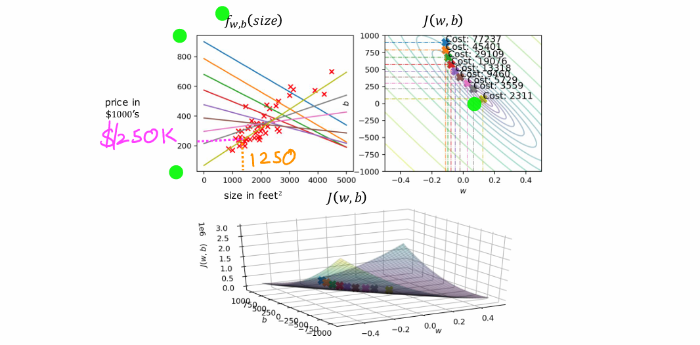

# 📘 Lecture 17 – Gradient Descent: Role of the Derivative and Learning Rate

This lecture explains **why Gradient Descent works** by focusing on the role of the **derivative** (slope) and the **learning rate** ($\alpha$).

---

## I. Review of Gradient Descent

* The **goal** is to minimize the **cost function** $J$.
* General update rule (for one parameter, $W$):

$$W := W - \alpha \cdot \frac{d}{dW} J(W)$$

- $\alpha$ = **learning rate** (**step size**).
- $\frac{d}{dW} J(W)$ = **derivative term** (the **slope of the tangent line**).

---

## II. Intuition with a One-Parameter Model

To simplify, consider **cost** $J$ as a function of just **one parameter** $W$.

- **Horizontal axis** $\rightarrow$ parameter $W$
- **Vertical axis** $\rightarrow$ cost $J(W)$

The derivative tells us which **direction** to move and how **strongly**.

### A. Case 1: On the **Right Side** of the Minimum

- At this point, the slope is **positive** ($\frac{d}{dW} J(W) > 0$).
- Update rule:

$$W := W - \alpha \cdot (\text{positive number})$$

- Result: $W$ **decreases** (moves **left**).
- This is correct, since moving left takes us **closer to the minimum**.

### B. Case 2: On the **Left Side** of the Minimum

- At this point, the slope is **negative** ($\frac{d}{dW} J(W) < 0$).
- Update rule:

$$W := W - \alpha \cdot (\text{negative number})$$

- Subtracting a negative number means **adding a positive number**.
- Result: $W$ **increases** (moves **right**).
- This is also correct, since moving right takes us **closer to the minimum**.

---

## III. The Learning Rate ($\alpha$)

* The learning rate $\alpha$ is multiplied by the derivative.
* It controls **how big a step** is taken at each update.

- **Large $\alpha$** $\rightarrow$ **big jumps** (risk **overshooting**, may **diverge**).
- **Small $\alpha$** $\rightarrow$ **tiny steps** (**stable** but very **slow**).

The combination of $\alpha$ and the derivative determines the **size of steps downhill**.

---

## IV. Summary 💡

- The **derivative** tells us the **direction** to move (left or right).
- The **learning rate $\alpha$** tells us the **size of the step**.
- Together, they ensure that Gradient Descent moves $W$ closer to the **minimum of $J$**.
- Next step: explore what happens when $\alpha$ is **too small or too big**, and how to choose a good value.

---
# 📘 Lecture 18 – The Role of the Learning Rate (α) in Gradient Descent

This lecture focuses exclusively on the critical role of the **Learning Rate (α)** in the Gradient Descent algorithm.  
It explains what happens if α is **too small** or **too large**, and why gradient descent naturally slows down near the minimum.

---

## I. The Impact of Learning Rate (α)

The choice of the learning rate **α** has a **huge impact** on how well gradient descent works.  
If α is chosen poorly, gradient descent may **not work at all**.

The update rule is:

$$
W := W - \alpha \times \frac{\partial}{\partial W} J(W, B)
$$

---

### A. Case 1: Learning Rate (α) is Too Small
* **Mechanism:** If α is very small (e.g., 0.0001), the derivative term is multiplied by a tiny number.  
* **Result:** The algorithm makes **tiny baby steps** downhill.  
* **Outcome:** Gradient descent will **work**, but it will be **very slow**.  
* **Summary:** Too small α → **slow convergence** (takes a lot of steps).

---

### B. Case 2: Learning Rate (α) is Too Large
* **Mechanism:** If α is too large, the algorithm takes **giant steps**.  
* **Result (Overshooting):**  
  - Instead of getting closer to the minimum, the parameter **overshoots**.  
  - Cost **J** may actually increase instead of decrease.  
* **Outcome:** Gradient descent may **fail to converge** or even **diverge completely**.  
* **Summary:** Too large α → **unstable, overshoot, or divergence**.

---

## II. Behavior Near the Minimum (Fixed α)

Even with a fixed learning rate α, gradient descent can successfully reach the minimum.

### A. Automatic Step Size Adjustment
* As the algorithm approaches a minimum, the **slope (derivative)** becomes smaller.  
* Because the update step is proportional to the derivative, the **steps naturally shrink**.  
* This means the algorithm **automatically slows down** near the minimum.

---

### B. At the Minimum: Zero Derivative
At the exact minimum:
1. The slope of the tangent line is **0**.  
2. Derivative term: $\frac{\partial}{\partial W} J(W, B) = 0$.  
3. Update rule: $W := W - \alpha \times 0 = W$.  
4. **Result:** $W$ stays the same.  

✅ This is correct behavior → once at the minimum, gradient descent **stops moving**.

---
## III. What if there are **Multiple Local Minima**?

Sometimes the cost function has **more than one valley** (local minimum).  
Here’s what happens in that case:

### 1) Which minimum will Gradient Descent reach?
- It depends on **where you start**.  
- Gradient Descent will slide down into the **nearest valley** from the starting point.

### 2) Effect of the learning rate (α)
- If α is **reasonable (not too big)** → it will settle in the nearest valley.  
- If α is **too large** → it may **jump out** of valleys, **oscillate**, or even **diverge**.

### 3) Can Gradient Descent leave a local minimum?
- **No.** Once it reaches a local minimum, the slope becomes ≈ 0 → the steps stop.  
- To escape, you must **restart with new values**, **add randomness/noise**, or use advanced methods.

### 4) Tips to deal with local minima
- Try **different random starting points** and pick the best result.  
- Use a **learning rate schedule** (start big, then make α smaller).  
- Use advanced optimizers like **Momentum** or **Adam**.  
- Apply **feature scaling/normalization** to make the cost surface smoother.

## IV. Summary

* The learning rate **α** controls the **step size** in gradient descent.  
* **Too small α** → convergence is slow.  
* **Too large α** → risk of overshooting, oscillation, or divergence.  
* Near the minimum, gradient descent **naturally takes smaller steps** (because the derivative shrinks).  
* At the minimum, the derivative = 0, so updates stop → algorithm has **converged**.

---
# 📘 Lecture 19 – GD for Linear Regression 

This lecture combines everything we have learned so far:
- The **linear regression model**
- The **squared error cost function**
- The **gradient descent algorithm**

Together, these form the **Linear Regression Learning Algorithm**.

---

## I. The Three Components Combined

1. **Model** (Prediction function):
   $$f_{W,B}(x) = W \cdot x + B$$

2. **Cost Function** (Squared Error):
   $$J(W,B) = \frac{1}{2m} \sum_{i=1}^{m} (f_{W,B}(x^{(i)}) - y^{(i)})^2$$

3. **Gradient Descent Algorithm**:
   Update $W$ and $B$ repeatedly to reduce $J$:
   $$W := W - \alpha \cdot \frac{\partial}{\partial W} J(W,B)$$
   $$B := B - \alpha \cdot \frac{\partial}{\partial B} J(W,B)$$

---

## II. Gradient Descent Update Equations for Linear Regression

For linear regression with squared error cost:

### A. Derivative with Respect to $W$
$$\frac{\partial}{\partial W} J(W,B) = \frac{1}{m} \sum_{i=1}^{m} \Big( f_{W,B}(x^{(i)}) - y^{(i)} \Big) x^{(i)}$$

- Includes the **error** term (prediction − actual) multiplied by the input feature $x^{(i)}$.

### B. Derivative with Respect to $B$
$$\frac{\partial}{\partial B} J(W,B) = \frac{1}{m} \sum_{i=1}^{m} \Big( f_{W,B}(x^{(i)}) - y^{(i)} \Big)$$

- Same as above but **without** the $x^{(i)}$ term.

---

## III. Full Linear Regression Gradient Descent Algorithm

Repeat until convergence:

$$W := W - \alpha \cdot \frac{1}{m} \sum_{i=1}^{m} \Big( f_{W,B}(x^{(i)}) - y^{(i)} \Big) x^{(i)}$$

$$B := B - \alpha \cdot \frac{1}{m} \sum_{i=1}^{m} \Big( f_{W,B}(x^{(i)}) - y^{(i)} \Big)$$

⚠️ **Important**: Updates of $W$ and $B$ must be done **simultaneously**.

---

## IV. Derivation of the Formulas (Optional)

- Start with the definition of the cost function.
- Recall that $f_{W,B}(x^{(i)}) = W x^{(i)} + B$.
- Apply calculus rules (chain rule).
- The factor of $1/2$ in the cost cancels the exponent’s 2, making the derivatives cleaner.

---

## V. The Shape of the Squared Error Cost Function

### A. Global vs. Local Minimum
- A **global minimum** is the lowest point overall.
- A **local minimum** is a low point but not the absolute lowest.

### B. Squared Error Property
- For **linear regression with squared error**, the cost function is a **convex function**.
- Convex = **bowl-shaped** $\rightarrow$ **only one minimum (the global minimum)**.
- No risk of getting stuck in local minima.

---

## VI. Summary

- We combined the model, cost function, and gradient descent to get the **Linear Regression Algorithm**.
- Gradient descent updates $W$ and $B$ using clean derivative formulas.
- For squared error cost, the function is **convex** $\rightarrow$ always one global minimum.
- As long as the learning rate $\alpha$ is reasonable, gradient descent will **always converge to the best solution**.

# 📘 Lecture 20 – Gradient Descent in Action (Batch Gradient Descent)

This lecture demonstrates the **Gradient Descent algorithm in action** for linear regression, showing how the parameters $W$ and $B$ are updated step by step, and introducing the term **Batch Gradient Descent**.

---

## I. Gradient Descent in Action for Linear Regression

The lecture uses **three plots at the same time**:

1. **Top Left (Model Plot):** Training data and the straight line fit $f(x)$.  
2. **Top Right (Contour Plot):** The cost function $J(W,B)$.  
3. **Bottom (3D Surface Plot):** The cost function $J(W,B)$ in 3D.  

---

### A. Initialization

- Parameters are set to initial values:  
  $W = -0.1$, $B = 900$.  
- The initial line is:  
  $$
  f(x) = -0.1x + 900
  $$

---

### B. The Iterative Process

- **Step 1:** The cost decreases a little; on the contour plot the point moves *down and right*.  
- **Subsequent Steps:** Each update lowers $J(W,B)$.  
- The fitted line gradually **matches the training data better**.  
- The path of $W,B$ heads toward the **minimum point**.

 
  

---

### C. Final Result

- At the **global minimum**, $W$ and $B$ define the **best fit line**.  
- Example use: Predict house price.  
  *If size = 1250 sqft → predicted price ≈ \$250,000.*  

`

---

## II. Terminology: Batch Gradient Descent

- In this lecture, the algorithm used is **Batch Gradient Descent**.  
- **Definition:** Each update step uses **all the training examples**.  
  $$
  J(W,B) = \frac{1}{m} \sum_{i=1}^{m} \big(f_{W,B}(x^{(i)}) - y^{(i)}\big)^2
  $$
- Here, $m$ = number of training examples (e.g., $m = 47$).  
- That’s why it’s called **batch** – it uses the **whole batch of data** at each step.  

👉 Note: There are other types like **Stochastic Gradient Descent (SGD)** or **Mini-batch Gradient Descent** that use subsets of the data, but linear regression here uses **batch GD**.

---

## III. Conclusion & Transition

- Gradient Descent **successfully fits the model** to the training data.  
- We have now implemented our **first ML algorithm: Linear Regression with one feature**.  
- Next topics will expand this:  
  - More features (multi-variable regression).  
  - Non-linear functions.  
  - Practical tips for real-world ML.

---

✅ **Summary:**  
- Gradient Descent updates $W,B$ step by step to minimize $J$.  
- Visualization shows the path from initial values to the global minimum.  
- **Batch Gradient Descent** = uses all training examples at every step.  
- Guarantees convergence (with proper learning rate) for linear regression since $J$ is convex.  
